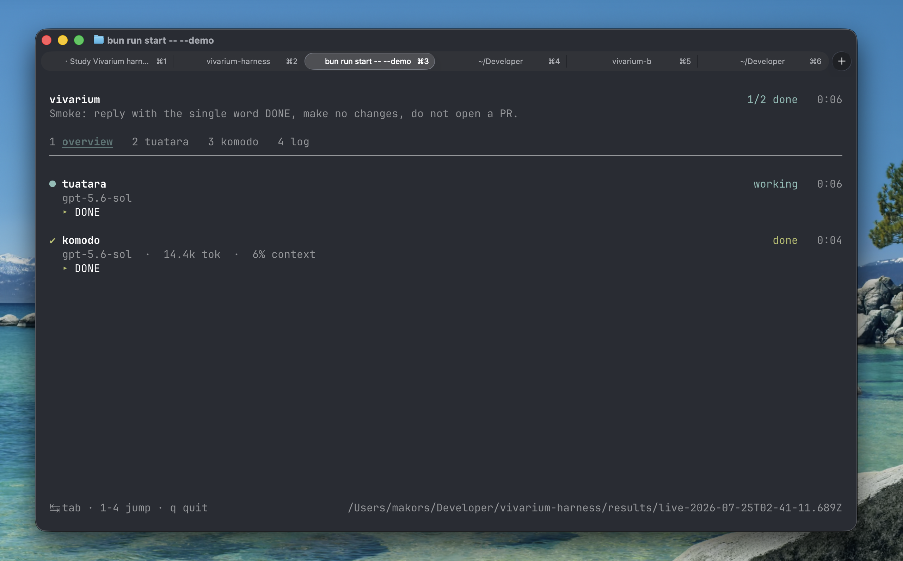

<div align="center">

<h1>vivarium harness</h1>



</div>

## meet the (g)reptiles

- **Tuatara** works in the checkout where Greptile review feedback is
  available.
- **Komodo** works in the matching plain checkout without that feedback.

Both start from the same commit and receive the exact same ticket. Every other
input is held constant, so differences in their results can be attributed to
the review feedback.

The experiment and UI use **Tuatara** and **Komodo**. Existing deployment and
artifact identifiers remain `GREPTILE`/`greptile` for Tuatara and
`CONTROL`/`control` for Komodo, keeping old configuration and run data
compatible.

## how it works

the harness runs on your host and does five things:

1. **builds one prompt** from your ticket — the same prompt for both arms.
2. **runs both arms in parallel.** each arm is a Codex session driven over MCP.
   the harness streams Codex's live events (files touched, commands run) as they
   happen, so nothing is a black box.
3. **retries a failing arm** up to 3 times. it resumes the same Codex thread
   where it can, otherwise restarts fresh with the error as context. an arm that
   uses up its retries is marked failed; the other arm keeps going regardless.
4. **lands the work.** each arm opens a pull request; tuatara is sent back to
   answer greptile's review on it before the harness merges. see "how a
   subticket lands" below.
5. **saves everything** to `results/<run-id>/` — the ticket, the prompt, and
   every request, response, status, transcript, review and merge from each arm
   and attempt.

each arm's Codex runs in its own Docker container, so one arm can't read the
other's checkout, the harness, or the host. the harness talks to both containers
over MCP.

## prerequisites

- [Bun](https://bun.sh)
- Docker
- an authenticated Codex CLI (`~/.codex/auth.json`, mounted read-only into each
  container)

## setup

```bash
bun install
cp .env.example .env
```

`.env` is the one place all arm config lives — checkouts, container names, and
each arm's GitHub token. both the harness and `scripts/arm-run.sh` read it, so
nothing goes on the command line. point it at two checkouts of the same commit:

```dotenv
CONTROL_REPO=/absolute/path/to/control-checkout
GREPTILE_REPO=/absolute/path/to/greptile-checkout
CONTROL_CONTAINER=vivarium-control     # already set in .env.example
GREPTILE_CONTAINER=vivarium-greptile
CONTROL_GH_TOKEN=ghp_...               # this arm's identity when it opens PRs
GREPTILE_GH_TOKEN=ghp_...
```

build the arm image once, then start one container per arm. `arm-run.sh` takes
only the arm name and reads the rest from `.env`:

```bash
docker build -t vivarium-arm .
scripts/arm-run.sh control
scripts/arm-run.sh greptile
```

each container mounts only its own arm's checkout at `/workspace`, mounts Codex
auth read-only, and writes its Codex sessions to a per-arm host directory
(`~/.vivarium/<container>/sessions` by default) so the harness can copy each
transcript into the run's artifacts. the arms never share a sessions directory.
to move it, set `<ARM>_CODEX_HOME` in `.env` — both `arm-run.sh` and the harness
read the same value.

## run

one command. bare `bun start` runs the experiment: greg plans the next rung onto
`LADDER.md`, both arms build its subtickets, repeat — pausing every 2 milestones
so you can reconfirm the direction.

```bash
bun start
```

options on that same loop:

```bash
bun start -- --unbounded      # don't pause every 2 milestones
bun start -- --plan-only      # plan rungs onto the ladder, build nothing
bun start -- --ticket "..."   # skip the ladder, run one ad-hoc ticket, exit
bun start -- --demo           # throwaway read-only run, no experiment repos needed
                              # (its view waits on the final frame until you press q)
bun start -- --no-tui --json  # machine-readable output for scripts
bun start -- --help           # every option, plus the env reference
```

there's a live view by default when stdout is a terminal: a fullscreen, tabbed
view of whatever codex sessions are running — greg while planning, the two arms
while building. tabs are an **overview** of every session, one **per session**
with its context meter, what it's been doing and its answer, greg's **ladder**
notes, and the raw **log**. `↹`/`←→` or `1`-`9` switch, `↑↓` scroll the lists,
`q` quits. it runs on the alternate screen and gives your terminal back
untouched when it's done.

quitting closes the view, not the run — a climb is meant to run for days, and
`q` is how you stop watching one. if sessions are still working when you quit,
the CLI says so and names them; they keep going and the feed keeps landing in
that arm's `progress.log`. if you did mean to stop everything,
`--abort-on-quit` makes `q` (and ctrl-c) tear the run down and exit 1.

without a terminal (or with `--no-tui`) the same feed is tee'd line by line.
either way it lands in `results/live-<ts>/` — one `progress.log` per arm, plus
`ladder.log` for the climb itself — and the CLI prints the run summary, the
pull requests each arm merged, and the artifact directory when it finishes. the
exit code is 1 if an arm exhausts its retries or lands nothing.

## if a run gets interrupted

you can just start it again. the ladder is the state, and a subticket's box is
only checked after its run actually succeeded — so a machine that dies mid-run
leaves that box unchecked and the next `bun start` picks it up. nothing else is
saved, so the interrupted subticket starts over from scratch; they're one
PR-sized step each, which is what makes that fine.

what doesn't reset is the two checkouts. both arms build the same subticket at
once, so a crash after one arm pushed and before the other did leaves its work
lying around — and the retry would hand that arm a ticket that's already done.
it finishes in seconds, "wins", and the comparison for that rung is quietly
junk. so clean both arms back to the same baseline first:

```bash
scripts/resume-clean.sh          # what did the interrupted run leave behind?
scripts/resume-clean.sh --apply  # reset both arms to origin/main
bun start                        # carry on
```

it never touches `main` — that's the climb so far — and work that already
merged is reported rather than thrown away. on a clean shutdown it does
nothing, so it's safe to run every time. add `--reconcile-linear` to also put
the board back in step with the ladder (issues left open, subtickets left
unfiled).

## what you get

every run writes to `results/<run-id>/`:

- the ticket, generated prompt, config, and the commit each arm started from,
  at the top level.
- a `greptile/` (Tuatara) and a `control/` (Komodo) directory, each holding
  that arm's MCP request and response, status, timing, and a copy of the Codex
  transcript.
- one `attempt-01/`, `attempt-02/`, … subdirectory per try, so retries are kept
  separately.
- a `land.json` per arm: the pull request it opened, every review round (what
  the reviewer said, what the arm answered), the whole conversation, and the
  merge. that file is the close reading — the arguing with greptile is in it.

a run where every arm succeeds is `completed`; one where an arm used up its
retries — or landed nothing — is `completed_with_failures`; a run that breaks
for infrastructure reasons is `failed`.

## how a subticket lands

a subticket isn't done when the agent says it is; it's done when it's merged.
around each build the harness does the mechanical half itself:

1. both checkouts are reset to `origin/main`, so each subticket starts where the
   last one merged rather than wherever the previous session left the tree.
2. both arms build it and open a pull request with `gh`, under their own token.
3. **tuatara** waits for greptile to review it, then gets sent back — with the
   pull request's URL and nothing else — to fetch the comments itself and reply
   to every one of them on the record. it argues, fixes, pushes; then the
   harness merges. **komodo** has no reviewer and merges straight away. that
   difference is the entire experiment.
4. no pull request, or a merge that won't go through, fails the arm and halts
   the climb with the box unchecked. a rung that didn't land doesn't look built.

a review that never shows up doesn't hold the climb: after `REVIEW_TIMEOUT_MS`
(15 minutes by default) the pull request merges unreviewed, and the timeout is
recorded as what happened.

## config

everything below is optional and lives in `.env`:

- `CODEX_HOME` — where to find Codex sessions (default `~/.codex`).
- `IDLE_TIMEOUT_MS` — abort an arm after this much silence with no events
  (default `600000`, 10 minutes; `0` disables the watchdog).
- `CODEX_SANDBOX` — Codex sandbox mode. leave it unset: a containerized arm
  then gets `danger-full-access` (it needs the network to push, open a PR and
  answer a review; the container is the isolation), a host arm gets
  `workspace-write`.
- `CONTROL_GH_TOKEN` / `GREPTILE_GH_TOKEN` — each arm's github identity. the
  container pushes with it and the harness merges with it.
- `GREPTILE_BOT_LOGIN`, `REVIEW_TIMEOUT_MS`, `REVIEW_ROUNDS` — who tuatara has
  to answer, how long to wait for them, and how many rounds it gets.
- `LINEAR_API_KEY` — bearer token for the `linear` MCP server greg files
  milestones and sub-issues through. unset means he skips linear.

tries per arm (`3`), the artifacts directory (`results`), and the ladder's
2-milestone pause are fixed constants in `src/config.ts`, not env vars.

## verify

```bash
bun run check
bun test
bun run build
```
